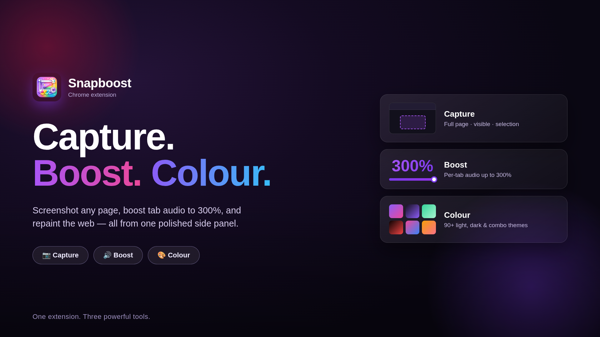

# Snapboost

**Capture the page. Boost the sound. Colour the web.**

An all-in-one Chrome extension (Manifest V3) that combines three real, useful
webpage tools: full-page/visible-area screenshots, per-tab audio boosting,
and full website recolouring with dark themes, single-colour themes, colour
combinations, style presets, and a custom theme creator.

Built entirely with plain HTML, CSS, and JavaScript — no frameworks, no
build tools, no external libraries, no remote servers, no accounts, no
analytics, no AI-generated results, and no fake data. Every feature listed
below is a real, working implementation.

## Demo

[](docs/media/snapboost-demo.mp4)

**[Watch the Snapboost product demo](docs/media/snapboost-demo.mp4)**

## 1. Overview

The popup is organised into three tabs, in the order the name promises:

1. **Capture** — visible-area and full-page screenshots
2. **Boost** — per-tab volume control up to 300%
3. **Colour** — dark/single/combo/style themes plus a custom palette creator

## 2. Main Features

- Real visible-area and full-page screenshot capture using `chrome.tabs.captureVisibleTab`, with section-by-section stitching, sticky-element hiding, and scroll restoration.
- A polished preview page with PNG/JPEG download, JPEG quality control, copy-to-clipboard, print, retake, delete, and zoom/fit controls.
- Real per-tab volume boosting (0%–300%) using the Web Audio API `GainNode`, with presets, mute/unmute, reset, and per-site memory.
- 90+ built-in colour themes (dark, single-colour, two-colour combinations, and style themes) applied through a targeted CSS-variable theme engine — never a flat overlay, hue-rotate, or image invert.
- A custom theme creator with colour pickers, automatic supporting-palette generation, favourites, JSON export/import, and per-site or global application.
- Per-site settings that override global settings, with an easy "Reset website" action.

## 3. Folder Structure

```
Snapboost/
│
├── manifest.json
├── background.js
├── content.js
├── theme-engine.js
├── audio-controller.js
├── screenshot-controller.js
├── storage-manager.js
├── utilities.js
│
├── popup/
│   ├── popup.html
│   ├── popup.css
│   └── popup.js
│
├── capture/
│   ├── preview.html
│   ├── preview.css
│   └── preview.js
│
├── assets/
│   ├── icon16.png
│   ├── icon32.png
│   ├── icon48.png
│   └── icon128.png
│
└── README.md
```

## 4. Installation (Load Unpacked)

1. Open `chrome://extensions`
2. Enable **Developer mode** (top-right toggle)
3. Click **Load unpacked**
4. Select the repository root folder, `Snapboost`
5. Pin the extension from the toolbar puzzle-piece menu
6. Open any normal website (e.g. Wikipedia) and open the popup to test each tab

## 5. Testing Capture

1. Open a long article or Wikipedia page.
2. In the **Capture** tab, click **Capture Visible Area** — a preview tab opens with exactly what was on screen.
3. Click **Capture Full Page** — watch the progress text ("Capturing section 2 of 6…"), then confirm the page scrolls back to where you started and the preview shows the full page stitched together.
4. Toggle "Capture appearance" between *Current colour theme* and *Original website* and re-capture to see the difference when a theme is active.
5. In the preview page, rename the file, download as PNG and JPEG (try different quality levels), use zoom controls, and try Copy/Print.

## 6. Testing Boost

1. Open a page with a video or audio player (e.g. a news site with an embedded video, or any page with `<audio>`/`<video>`).
2. Open the **Boost** tab — it reports how many media elements were found.
3. Drag the slider or click a preset (100/125/175/200/300%) and confirm the audio gets quieter/louder immediately.
4. Click **Mute Tab**, confirm it changes to **Unmute Tab**, then unmute and confirm the previous level returns.
5. Click **Reset** to return to 100% and clear any boosting.
6. Enable "Remember for <site>", reload the page, reopen the popup, and confirm the level was restored.

## 7. Testing Colour

1. Open the **Colour** tab on any website.
2. Switch to **Dark** and pick "AMOLED Black" or "Soft Dark" — the whole page recolours, but images/videos stay natural.
3. Try a two-colour combo (e.g. "Purple + Pink") and a style theme (e.g. "Cyberpunk").
4. Adjust the intensity/brightness/contrast sliders and watch the page update live.
5. Click **Original** to restore the site instantly.

## 8. Creating Custom Themes

1. Switch to the **Custom** mode in the Colour tab.
2. Pick a main and secondary colour, then click **Generate matching palette** to auto-fill background, surface, text, muted text, border, and button-text colours with accessible contrast.
3. Name your theme and click **Save theme** — it appears in the grid below and can be applied like any preset.
4. Use **Duplicate**, **Export JSON**, or **Import JSON** to back up or share a theme file (theme data never leaves your device unless you choose to share the exported file yourself).

## 9. Per-Site Settings

- "Remember theme/volume for `<hostname>`" stores a setting keyed by hostname in `chrome.storage.local`.
- "Apply theme to every website" sets a global default used whenever a site has no specific setting.
- "Disable colour changes on this website" blocks theming on that hostname even if a global theme is active.
- Per-site settings always take priority over global settings.
- "Reset website" clears all per-site Colour/Boost settings for the current hostname.

## 10. Keyboard Shortcuts

Default suggested shortcuts (Chrome may reassign these if already in use):

| Action | Shortcut |
|---|---|
| Capture full page | `Ctrl+Shift+S` |
| Capture visible area | `Ctrl+Shift+V` |
| Toggle current colour theme | `Ctrl+Shift+C` |
| Mute/unmute current tab | `Ctrl+Shift+M` |
| Open popup | Pin the toolbar button; assign manually if Chrome offers it |

Chrome allows a maximum of four default extension shortcuts in the manifest, so the four feature actions get defaults. Change or add shortcuts at `chrome://extensions/shortcuts`.

## 11. Permissions

| Permission | Why it's needed |
|---|---|
| `activeTab` | Interact with the tab you're currently viewing when you use the popup |
| `tabs` | Read the active tab's URL/hostname to detect supported pages and title for filenames |
| `storage` | Save your settings, themes, and preferences locally with `chrome.storage.local` |
| `scripting` | Inject the content script that applies themes, controls audio, and captures screenshots |
| `downloads` | Save screenshots and exported theme files to your device |

No `history`, `bookmarks`, `identity`, `cookies`, `geolocation`, `camera`, or `microphone` permissions are requested, and no host permissions beyond the tab you're actively using.

## 12. Privacy

- No user accounts, sign-in, or subscriptions.
- No analytics or tracking of any kind.
- No advertising or ad trackers.
- No external servers — everything runs locally in your browser.
- No browsing-history collection.
- Screenshots are never uploaded; they stay on your device until you choose to download or delete them.
- No webpage content is ever transmitted anywhere.
- No personal data is collected, stored remotely, or sold.
- Audio processing happens locally via the Web Audio API.
- Colour themes are generated and applied entirely client-side.

## 13. Known Limitations

- Browser-internal pages (`chrome://`, `edge://`, `about:`, DevTools) cannot be modified by any extension — this is a browser security restriction.
- The Chrome Web Store cannot be modified by extensions.
- Some websites use DRM-protected or cross-origin audio that the Web Audio API cannot connect to; normal mute still works there.
- Cross-origin iframes cannot always be read or restyled due to browser security boundaries.
- Extremely tall pages may exceed the browser's canvas size limit; these are automatically exported as multiple labelled image parts instead of one image.
- Pages that continuously grow in height during capture (infinite scroll) may capture inconsistently — retake if this happens.
- Closed Shadow DOM content cannot be styled by any extension.
- Some complex web apps (canvas-heavy dashboards, custom video players, in-browser IDEs) may partially override the injected theme styles.

## 14. Troubleshooting

- **"This browser page cannot be modified by extensions"** — you're on a `chrome://`, `edge://`, or similar internal page. Navigate to a normal website.
- **Nothing happens when boosting volume** — the site may use protected/DRM audio, or no media element has started playing yet. Play the media first, then try again.
- **Screenshot looks cut off or duplicated headers** — enable "Hide sticky elements" before capturing, and avoid resizing the window mid-capture.
- **Theme colours look partially applied** — some sites load content dynamically after the theme is applied; wait a moment and it will catch up automatically, or reapply the theme.
- **Extension icon does nothing** — check that it's pinned and that you're not on a restricted page.

## 15. Testing Checklist

Capture:
- [ ] Visible-area capture matches what's on screen
- [ ] Full-page capture stitches correctly with no duplicated headers
- [ ] Scroll position returns to where it started
- [ ] PNG and JPEG downloads work with correct filenames
- [ ] Oversized pages produce clearly labelled multi-part exports

Boost:
- [ ] 100% sounds identical to no boosting
- [ ] Presets and slider apply immediately
- [ ] Mute/unmute preserves the prior level
- [ ] Reset clears boosting and unmutes
- [ ] Per-site volume is remembered and restored

Colour:
- [ ] Dark, single, combo, and style themes all apply correctly
- [ ] Images and videos remain untouched by default
- [ ] Buttons, links, and forms stay usable and readable
- [ ] Reset restores the original site instantly
- [ ] Per-site settings override the global theme

## 16. Packaging for Distribution

1. Remove any local test artifacts (none are created by this extension by default).
2. From the parent directory, package the repository folder, excluding `.git` — e.g. `zip -r snapboost.zip Snapboost -x 'Snapboost/.git/*'`.
3. Verify the zip loads cleanly via **Load unpacked** by extracting it to a fresh folder and loading that.

## 17. Chrome Web Store Preparation Notes

- Use `icon128.png` as the store listing icon.
- Write a store description that matches this README's feature list — do not claim capabilities beyond what's implemented (e.g. do not claim audio boosting works on every DRM-protected site).
- Prepare at least one screenshot of each tab (Capture, Boost, Colour) for the store listing.
- Complete the Chrome Web Store's privacy practices disclosure using Section 12 above as the source of truth — this extension collects no remote data.
- Confirm the manifest's `version` field is incremented for any resubmission.
